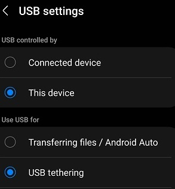

# ToDoMAUI

## Resources
- New to .NET MAUI? [Build your first app](https://learn.microsoft.com/en-us/dotnet/maui/get-started/first-app?tabs=vswin&pivots=devices-android) 
shows how to get started in Visual Studio
- [Set up local Android Device for debugging](https://learn.microsoft.com/en-us/dotnet/maui/android/device/setup)
  Note* In addition to installing manufacturer specific drivers for the target phone (as per the instructions), USB Settings had to be changed from the default
  to USB tethering
  
  
